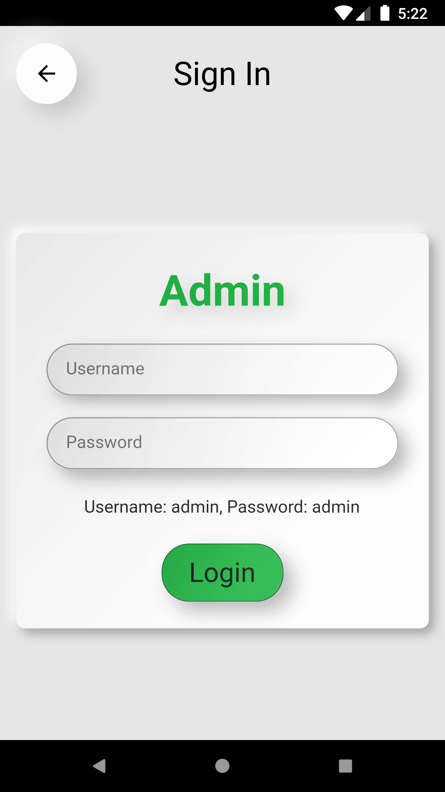
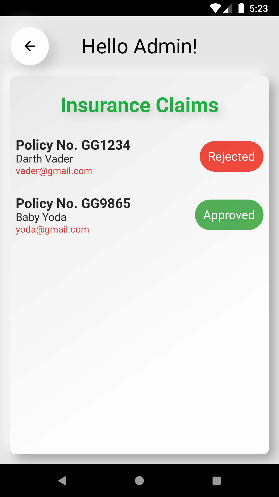
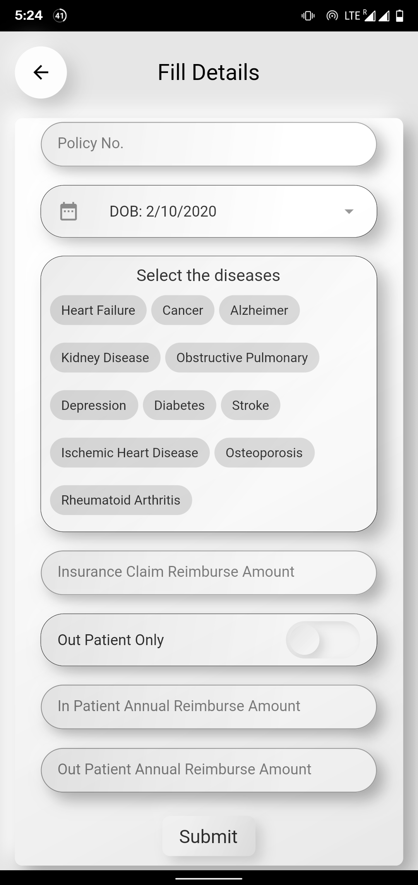
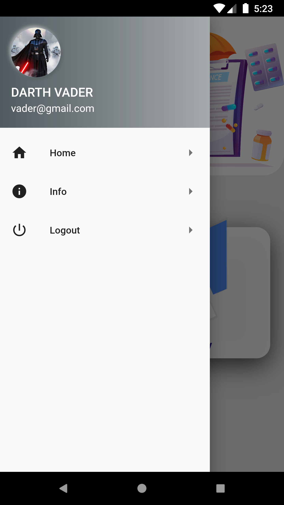
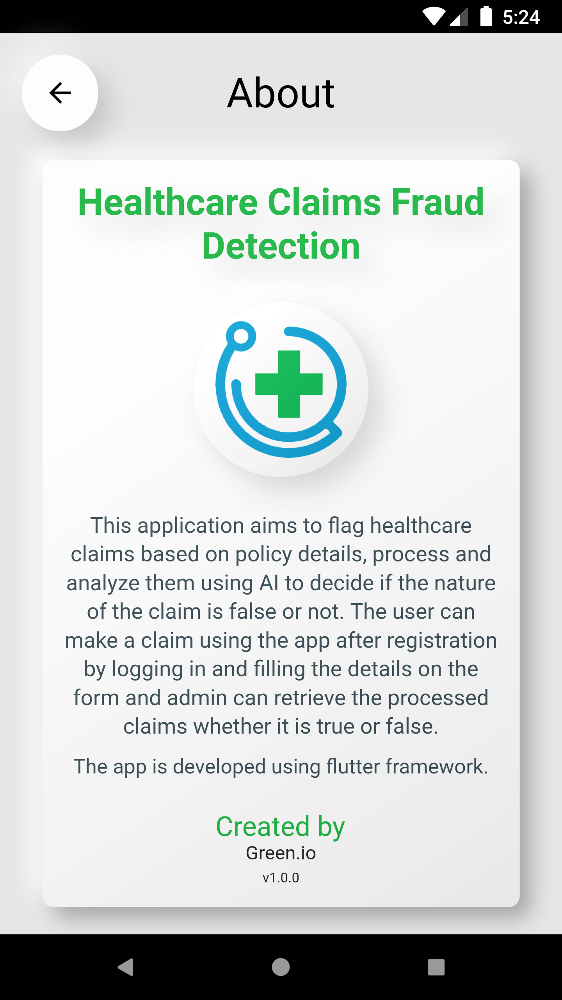
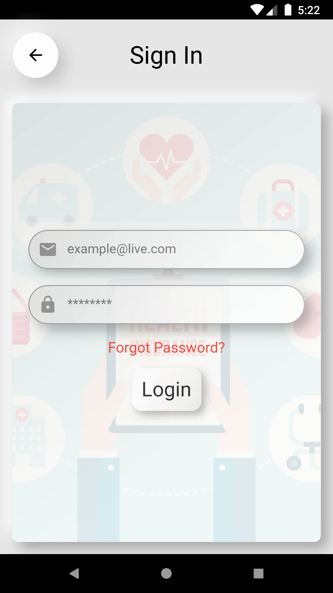
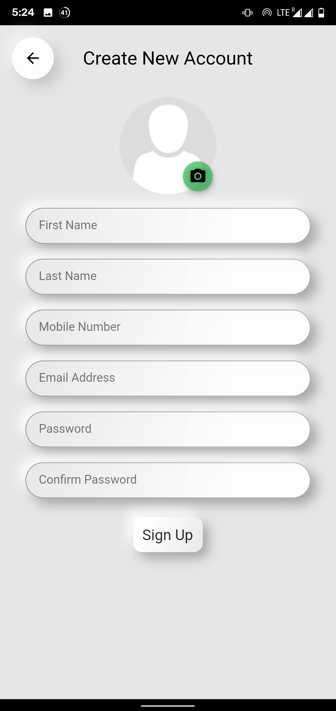

# HealthCare Claims Application for Android

## About the Application:
HealthCare Claims is an **AI-based Android Application** tool that enables people to flag the claims as fraud or not.
This is an android application, developed using Flutter and Flask, can be run on any android mobile phone to get the output instantaneously. 

## View Demo:
https://youtu.be/2qdDjE1wY9M

## Screenshots:
</a>
</a>
</a>
</a>
</a>
</a>
</a>
</a>
</a>
